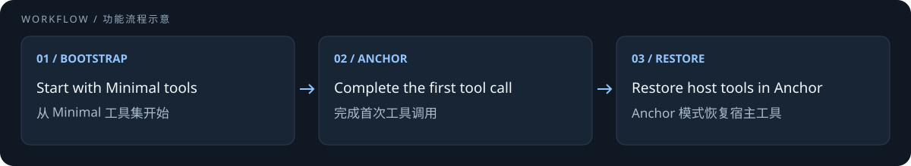

# SeekAnchor

[Pi 安装](#pi-安装与使用) · [OMP 安装](#oh-my-pi-安装与使用) · [OpenCode 安装](#opencode-v2-安装与使用)



> 图示为 Anchor 模式。项目仍为实验性质，不保证任务成功率或输出质量提升。

[English](README.md) | [简体中文](README.zh-CN.md)

SeekAnchor 用于将 DeepSeek V4 Pro 引导到 DSH Minimal agent trajectory，目标是让
模型更稳定地自然进入类似 “We need” 和 “Let's” 的推理轨迹，而不是直接要求模型
输出这些短语。

目前提供三种运行时适配：

- Pi
- Oh My Pi（OMP）
- OpenCode V2 beta

Codex 和 Claude Code 不在当前适配范围内。

## 已手工验证的环境

在以下环境的手工测试中，均已观察到模型可被引导至目标推理轨迹，包括反复出现
“We need” 和 “Let's” 等模式：

| Agent | 环境 |
| --- | --- |
| Pi | Termux |
| Pi | Windows 11 |
| Oh My Pi（OMP） | Windows 11 |
| OpenCode CLI | Windows 11 |

这些结果说明上述环境中可以出现该引导效果，但不属于自动化 benchmark，也不保证
每次请求都能进入该轨迹或产生更好的结果。

## 仓库结构

```text
.pi/extensions/deepseek-rl-anchor/   Pi 运行时；从项目根目录启动 Pi 时自动加载
.omp/extensions/deepseek-rl-anchor/  Oh My Pi 运行时；从项目根目录启动时自动加载
.opencode/plugins/seek-anchor/       OpenCode V2 运行时；打开项目时自动发现
developer/                            测试和原始研究实现；不会被运行时加载
```

运行时与开发者内容已经分离。正常使用只会加载模式控制和两个 DSH 工具；测试、
benchmark、实验矩阵、JSONL 日志和指纹分析均保留在 `developer/`。

## Pi 安装与使用

### 在当前项目直接使用

当前仓库已经采用 Pi 的项目扩展目录结构，不需要执行安装命令：

```powershell
cd path\to\SeekAnchor
pi
```

如果 Pi 在复制扩展之前已经启动，执行：

```text
/reload
```

然后检查状态或切换模式：

```text
/ds-status
/ds-mode native
/ds-mode minimal
/ds-mode anchor
/ds-anchor-variant A
/ds-anchor-variant B
```

输入 `/ds-mode ` 或 `/ds-anchor-variant ` 后可以按 Tab 选择 `minimal`、`A` 等合法
二级参数。

默认模式是 `native`。项目设置保存在
`.pi/deepseek-rl-anchor/settings.json`，不会修改 Pi 的全局配置。

### 安装到另一个 Pi 项目

只复制运行时目录，不要复制 `developer/`：

```powershell
$seekAnchorSource = Resolve-Path ".pi\extensions\deepseek-rl-anchor"
$targetRuntime = "D:\path\to\target-project\.pi\extensions\deepseek-rl-anchor"
New-Item -ItemType Directory -Force -Path $targetRuntime | Out-Null
Copy-Item -Path (Join-Path $seekAnchorSource "*") -Destination $targetRuntime -Recurse -Force
```

进入目标项目启动 Pi；如果 Pi 已经运行，执行 `/reload`。

### 为 Pi 全局安装

全局安装后，所有 Pi 项目都能发现这个扩展。以下命令仍然只复制运行时文件：

```powershell
$seekAnchorSource = Resolve-Path ".pi\extensions\deepseek-rl-anchor"
$globalRuntime = Join-Path $env:USERPROFILE ".pi\agent\extensions\deepseek-rl-anchor"
New-Item -ItemType Directory -Force -Path $globalRuntime | Out-Null
Copy-Item -Path (Join-Path $seekAnchorSource "*") -Destination $globalRuntime -Recurse -Force
```

重新启动 Pi，或在已运行的 Pi 中执行 `/reload`。

> Pi 扩展以当前用户权限运行，只应安装可信代码。这个仓库目前不是 Pi Package，
> 因此不要对仓库地址使用 `pi install`；使用上面的运行时复制方式。

### 让 Pi 自己全局安装

从本仓库根目录启动 Pi，然后发送下面的提示词：

```text
请为当前用户全局安装 SeekAnchor 的 Pi 运行时。

要求：
1. 先确认当前工作目录是 SeekAnchor 仓库根目录，并读取 README.zh-CN.md 与 .pi/extensions/deepseek-rl-anchor/README.md。
2. 源目录必须是 .pi/extensions/deepseek-rl-anchor/，目标目录必须是当前用户的 ~/.pi/agent/extensions/deepseek-rl-anchor/。
3. 只复制运行时扩展目录；不要复制 developer/、.opencode/、测试、日志或 benchmark 内容。
4. 不要修改源文件、项目设置、~/.pi/agent/settings.json、认证文件或任何无关的全局配置。
5. 写入前解析并显示源目录和目标目录的绝对路径。如果目标目录已经存在，停止操作并报告，得到我的确认后才能覆盖任何内容。
6. 复制完成后，确认目标目录包含 index.ts、state.ts、dsh/ 和 tools/；不要调用模型 API 做测试。
7. 报告执行的所有文件操作，并在完成后提醒我执行 /reload 或重启 Pi。
```

当前正在运行的 Pi 不会自动启用刚复制的全局扩展。安装完成后执行 `/reload`，或
重新启动 Pi。

## Oh My Pi 安装与使用

Oh My Pi 使用独立的 `.omp` 运行时副本，因此不会与 Pi 的设置互相覆盖。在本仓库
根目录可以直接启动，不需要先安装：

```powershell
omp
```

OMP 会自动发现 `.omp/extensions/deepseek-rl-anchor/`，并提供和 Pi 相同的本地命令：

```text
/ds-mode native|minimal|anchor
/ds-anchor-variant A|B
/ds-status
```

OMP 同样支持在 `/ds-mode ` 和 `/ds-anchor-variant ` 后按 Tab 补全二级参数。

配置保存在 `.omp/deepseek-rl-anchor/settings.json`。Minimal 使用 DSH prompt、
DSH-compatible `bash` 和 `str_replace_editor`；Native 以及 Anchor 晋升后会恢复 OMP
原有 prompt 和工具列表，`bash` 包装器会委托给 OMP 原生工具生命周期执行。

为默认 OMP profile 全局安装：

```powershell
powershell -ExecutionPolicy Bypass -File .omp\install-global.ps1
```

安装器支持通过 `PI_CODING_AGENT_DIR` 指定自定义/profile agent 根目录，只复制运行时
文件；目标已存在时会停止，除非显式传入 `-Force`。完成后执行 `/reload` 或重启 OMP。
如果要让 OMP 自己安装，可在 OMP 中打开本仓库，要求它阅读本节并运行同一脚本且不要
传 `-Force`；遇到已有目标必须停止并报告，不得自行覆盖。

使用 OMP 命名 profile 时，可以先设置 `PI_CODING_AGENT_DIR`，或显式传入对应 agent
目录，例如 `-AgentRoot "$HOME\.omp\profiles\work\agent"`。

## OpenCode V2 安装与使用

### 兼容性

当前适配依赖 OpenCode V2 beta 插件 API，并固定了经过类型检查的
`@opencode-ai/plugin` 版本。普通 OpenCode V1 不能直接使用这份插件。

安装 V2 CLI：

```powershell
npm install -g @opencode-ai/cli@next
```

V1 与 V2 可以并存；V2 的命令是 `opencode2`。

### 手动安装项目依赖

在项目根目录执行：

```powershell
npm install --prefix .opencode
```

然后启动 V2：

```powershell
opencode2
```

OpenCode 会自动发现 `.opencode/plugins/seek-anchor/index.ts`。如果使用支持 V2
插件 API 的 OpenCode Desktop，请完整退出桌面端，然后把克隆后的 SeekAnchor 仓库
作为项目目录重新打开。

可以通过 V2 API 检查插件是否已经加载：

```powershell
opencode2 api --standalone get /api/plugin
```

输出中应包含：

```text
seekanchor.runtime
```

### 为 OpenCode 全局安装

全局安装后，当前用户的所有 OpenCode 项目都可以发现 SeekAnchor：

```powershell
powershell -ExecutionPolicy Bypass -File .opencode\install-global.ps1
```

安装器只会把运行时插件复制到 `%USERPROFILE%\.config\opencode`，并在该目录安装
锁定版本的插件 API 依赖；已有全局 `seek-anchor.json` 会被保留。默认遇到已存在
的 SeekAnchor 目标就停止，检查后
才能显式使用 `-Force` 合并/覆盖运行时文件。不要在同一个项目同时启用项目级和
全局副本。安装完成后必须完整重启 OpenCode。

### 让 OpenCode 自己安装

在 OpenCode 中打开本仓库根目录，然后发送下面的提示词：

```text
请为当前 SeekAnchor 项目安装 OpenCode 运行时依赖。

要求：
1. 先确认当前工作目录是仓库根目录，并读取 README.md 与 .opencode/package.json。
2. 不要修改插件源码、.opencode/seek-anchor.json、developer/ 或任何全局配置。
3. 只执行项目级安装：npm install --prefix .opencode。
4. 安装后确认 .opencode/node_modules/@opencode-ai/plugin 存在，并报告安装版本。
5. 检查当前 OpenCode 是否支持 V2 beta 插件 API；如果是 V1，请停止并明确告诉我不兼容，不要尝试改写成 V1。
6. 不调用模型 API 做额外测试，也不要运行 developer/ 下的测试。
7. 最后告诉我是否需要完整重启 OpenCode Desktop。
```

依赖安装完成后，完整重启桌面端并重新打开项目。

### OpenCode 模式配置

编辑 `.opencode/seek-anchor.json`：

```json
{
  "mode": "minimal",
  "anchorVariant": "A",
  "bashBackend": "opencode"
}
```

OpenCode 支持：

- `minimal`：始终使用 Minimal system prompt。默认原生后端只暴露 OpenCode 的
  `shell` 和 `str_replace_editor`；DSH 后端暴露 `bash` 和
  `str_replace_editor`。
- `anchor`：开始时使用 Minimal 组合；第一次成功执行 Minimal 工具后，在下一次
  请求恢复完整工具列表。
- variant A：Anchor 后保留 Minimal system prompt。
- variant B：Anchor 后恢复 OpenCode system prompt。
- `bashBackend: "opencode"`（默认）：保留 OpenCode 原生 `shell` 执行器，以及权限、
  取消和后台任务生命周期；Minimal 阶段只呈现收窄后的 command-only schema。由于
  OpenCode V2 的原生工具名不是 `bash`，模型看到的名称仍为 `shell`。
- `bashBackend: "dsh"`：增加 SeekAnchor 的持久化 `bash`，用于更接近 DSH 工具身份
  和行为的复现实验。

OpenCode 适配器不会注册任何 `ds-*` 命令。OpenCode 公开的自定义命令是会发送给
模型的 prompt template，不是本地回调；因此模式控制改为只使用配置文件，不会为了
切换模式额外触发模型请求。项目级安装编辑 `.opencode/seek-anchor.json`，全局安装
编辑 `~/.config/opencode/seek-anchor.json`。

模式和 variant 会在后续请求重新读取。切换 bash 后端必须完整重启，因为执行器在
插件挂载时注册。

适配器故意不提供模拟的 `native` 模式。要进行真正的 OpenCode 原生对照，应禁用
插件 ID `seekanchor.runtime`。使用默认 `opencode` 后端时，Anchor 会恢复原生
`shell` 的完整定义；使用可选 `dsh` 后端时，Anchor 会恢复宿主完整工具列表，同时
插件提供的 `bash` 会与 OpenCode 原生 `shell` 并存。

## 模式含义

- `native`：Pi 与 Oh My Pi 支持，使用宿主 prompt 和宿主工具。
- `minimal`：DSH Minimal prompt，加按后端选择的原生 `shell` 或 DSH `bash`，以及
  `str_replace_editor`。
- `anchor`：从 Minimal 开始，第一次成功的 Minimal 工具调用后恢复宿主工具。

## 适配其他 Agent 的思路

为其他 Agent 编写适配器时，应复现模型实际可见的 composition，而不只是追加一句
要求模型输出 “We need” 或 “Let's” 的提示。宿主至少需要提供一个位于模型请求发送
之前的扩展或中间件入口，允许按当前请求检查并修改 system prompt、messages 和工具
列表。

实际实现建议遵循以下原则：

1. 在 bootstrap 阶段挂载完整 Minimal system prompt，并且只暴露预定的执行工具和
   `str_replace_editor`。
2. 将模型可见 schema 与执行后端分开设计。首先保持工具身份和 schema；当宿主
   权限与生命周期更重要时，保留原生执行器，只收窄请求中模型可见的定义。如果
   宿主的原生工具名不同（OpenCode V2 使用 `shell`），则无法同时保留精确 DSH 工具
   身份和原生执行器；应明确记录该取舍，并为更接近复现提供自定义 `bash` 后端。
3. Anchor 状态必须按 session 隔离，不能使用会让一个会话状态泄漏到另一个会话的
   进程级布尔值。
4. 明确定义晋升信号。SeekAnchor 当前在 Minimal 工具成功返回后晋升；其他宿主也
   可以使用持久化的 tool call 或 assistant message 事件。需要明确规定重试、恢复
   会话和 reload 时的行为；如果宿主允许，应从持久化事件重建状态。
5. 晋升后按照 variant A 或 B 恢复宿主 prompt 和/或完整工具列表，并明确记录哪些
   插件工具会继续与恢复后的原生工具列表并存。
6. 将 benchmark、请求快照、日志和语言统计放在运行时自动发现路径之外。这些是
   开发者测试能力，不是 Agent 的实际工具能力。
7. 分别验证第一次模型请求的真实 system prompt 与工具 schema，以及 Anchor 后的
   下一次请求。效果应通过任务成功率和可重复评测判断，而不是只看措辞出现次数。

如果宿主不能修改最终请求 composition，或不能结构化替换工具，可以做纯提示词
模仿，但它不等同于本项目的锚定方式。

## 开发者内容

原始研究实现保存在 `developer/reference-implementation/deepseek-rl-anchor/`，位于
Pi 和 OpenCode 的自动发现路径之外。

本地验证命令：

```powershell
npm install
npm test
npm run typecheck:opencode
npm run test:global-install
npm run test:omp-global-install
```

这些命令只面向开发者；正常安装 Pi、Oh My Pi 或 OpenCode 运行时时不需要执行。

原始 README 提到的部分审计、vendor source 和 benchmark artifact 并未包含在最初
提供的压缩包中。在补齐并重新运行之前，相关结论应视为未验证。

## 范围说明

> **SeekAnchor 仅用于实验性地引导模型推理轨迹，不保证引导后输出的质量、正确性、
> 安全性、任务成功率或任何后续效果。**

SeekAnchor 复现的是模型可见的 prompt/tool composition。它不声称能够解锁隐藏
思维链，也不能仅凭语言模式证明能力提升。使用者仍需独立审核输出，并通过可重复
的任务成功率评测实际效果。

## 许可证

SeekAnchor 使用 [MIT License](LICENSE)，版权所有 © 2026 vavilonska7。上游来源与
署名见 [THIRD_PARTY_NOTICES.md](THIRD_PARTY_NOTICES.md)。

## 致谢

特别感谢 [xiaobright/dsh-anchored-standard](https://github.com/xiaobright/dsh-anchored-standard)
提供的思路。该项目提出的“两阶段”方向——先以 Minimal prompt 和真实 Minimal
工具 schema 建立初始轨迹，再恢复完整工具集合——为 SeekAnchor 的 Anchor 模式
设计提供了重要启发。

## 上游文档

- [Pi Extensions](https://github.com/badlogic/pi-mono/blob/main/packages/coding-agent/docs/extensions.md)
- [Oh My Pi Extensions](https://github.com/can1357/oh-my-pi/blob/main/docs/extensions.md)
- [Oh My Pi 扩展加载](https://github.com/can1357/oh-my-pi/blob/main/docs/extension-loading.md)
- [OpenCode V2 Plugins](https://opencode.ai/v2/docs/build/plugins)
- [OpenCode V1 迁移到 V2](https://opencode.ai/v2/docs/migrate-v1)

## Related projects / 相关项目

[OMPmail](https://github.com/vavilonska/OMPmail) · [OMP Pet](https://github.com/vavilonska/omp-pet) · [All projects / 全部项目](https://github.com/vavilonska#projects--项目)
